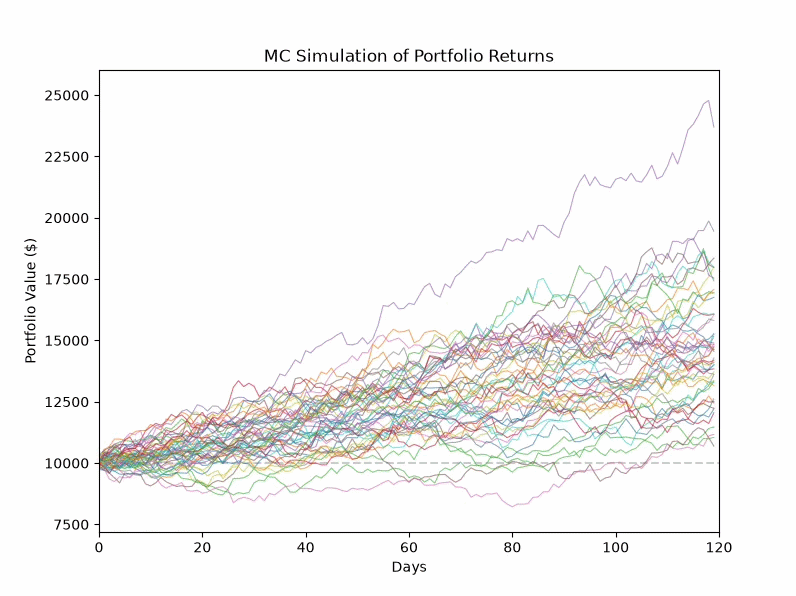
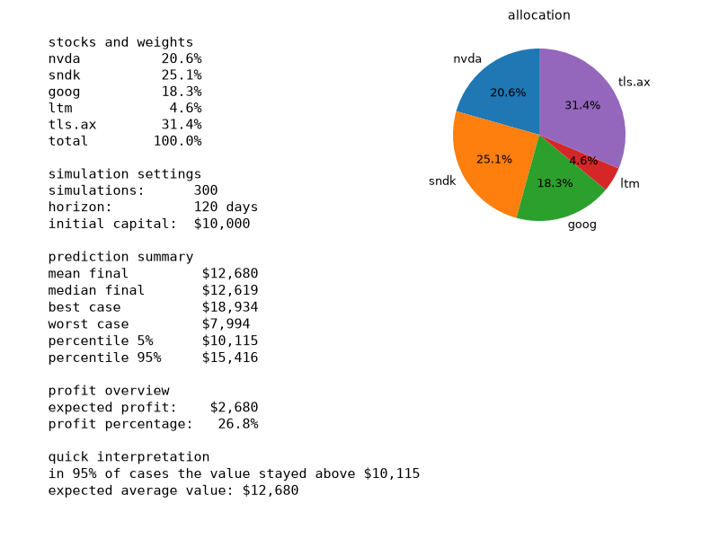

Monte Carlo Simulation of a Stock Portfolio

this project runs a monte carlo simulation on a basket of stocks to project portfolio value over time. it generates hundreds of random scenarios based on historical returns and correlations, then summarizes the outcomes statistically.

preview

animation

dashboard

quick start

install dependencies
pip install -r requirements.txt

run
python main.py

two windows will open:
1. the live animation of all simulation paths
2. the text dashboard with statistics and allocation pie chart

understanding the output

stocks and weights
each ticker and its portfolio allocation percentage. the total line confirms the weights sum to 100%.

simulation settings
- simulations: number of random scenarios generated
- horizon: projection length in days
- initial capital: starting portfolio value

prediction summary
- mean final: average ending value across all scenarios
- median final: middle value (half above, half below)
- best case: highest ending value observed
- worst case: lowest ending value observed
- percentile 5%: 95% of scenarios ended above this value
- percentile 95%: 95% of scenarios ended below this value

profit overview
- expected profit: mean final minus initial capital
- profit percentage: expected profit as a percentage of initial capital

quick interpretation
plain-language takeaways for readers who do not want to parse tables.

tickers

| ticker | company |
|--------|---------|
| nvda | nvidia corporation |
| sndk | sandisk |
| goog | alphabet inc. |
| ltm | lithium americas |
| tls.ax | telstra corporation |

tech stack

pandas, numpy, matplotlib, yfinance

disclaimer

this is an educational tool. results are based on historical data and assume past behavior repeats, which is not guaranteed. do not use this for actual investment decisions without consulting a qualified professional.